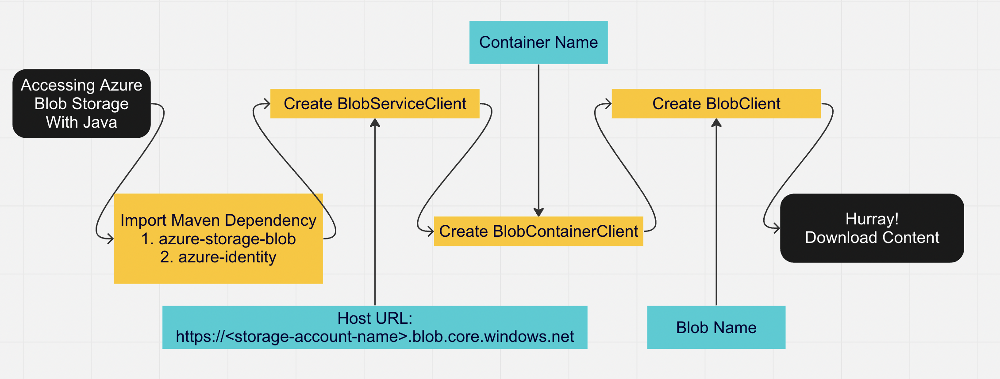

# Reading from azure blob storage



## Maven Dependencies

```<!-- https://mvnrepository.com/artifact/com.azure/azure-storage-blob -->
    <dependency>
      <groupId>com.azure</groupId>
      <artifactId>azure-storage-blob</artifactId>
      <version>12.22.1</version>
    </dependency>
```
```
<!-- https://mvnrepository.com/artifact/com.azure/azure-identity -->
    <dependency>
      <groupId>com.azure</groupId>
      <artifactId>azure-identity</artifactId>
      <version>1.9.0</version>
      <scope>compile</scope>
    </dependency>
```

## Other requirements:

- Blob URL
- Client ID
- Client Credential
- Tenant ID
